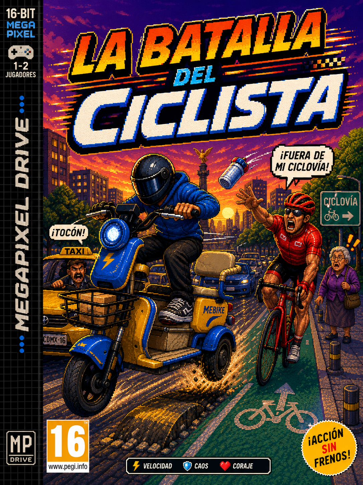
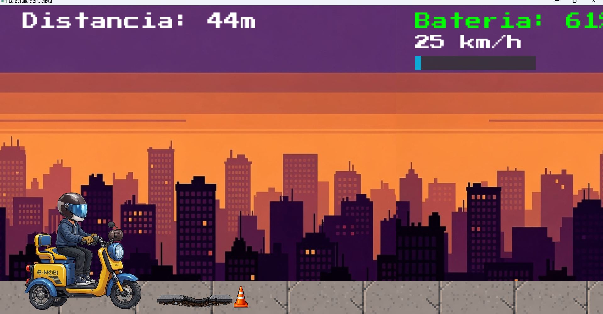
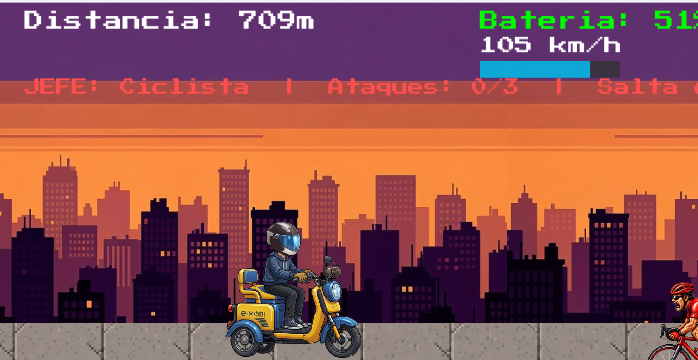
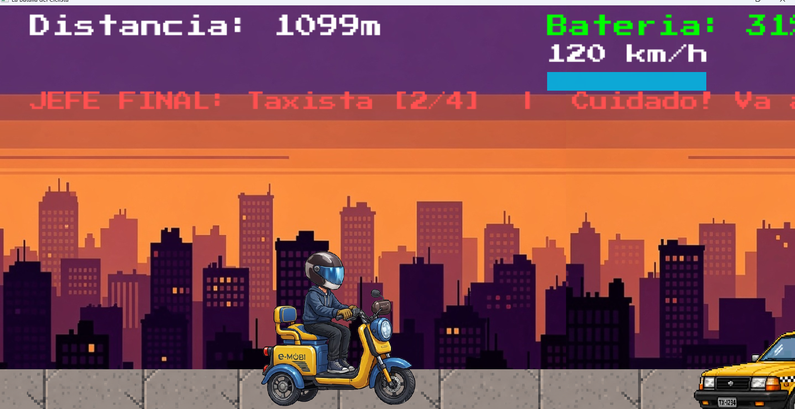

# La-Batalla-del-ciclista-
Markdown
# ⚡ VG Advanced Mobility: Caos Vial

## 📖 Descripción del Proyecto
**VG Advanced Mobility: Caos Vial** es un desafiante videojuego de plataformas y velocidad en 2D desarrollado en C++ utilizando SFML 3. Asume el control de un usuario de motobici eléctrica enfrentándose al verdadero caos urbano. El objetivo es recorrer la mayor distancia posible administrando el nivel de tu batería de litio, esquivando baches y sobreviviendo a los "jefes" de la ciudad que no respetan los carriles de movilidad alternativa.

## ⚙️ Mecánicas Principales
- **Gestión de Energía:** Tu vehículo funciona con una celda de litio. Avanzar y saltar drena tu voltaje. Debes recolectar power-ups de baterías en el camino para mantenerte en movimiento.
- **Físicas de Inercia:** Sistema de salto y gravedad variable. Agacharte mejora tu aerodinámica para pasar por debajo de obstáculos.
- **Enfrentamiento contra Jefes:** - *La Abuela Justiciera:* Defiende la banqueta lanzando proyectiles.
  - *El Ciclista Purista:* Frena de golpe en la ciclovía para hacerte chocar.
  - *El Taxista Furioso:* Te embiste agresivamente en el carril de los carros.

## 🎮 Controles
- `Espacio` (Spacebar): Acelerar / Saltar (Consume batería extra por el torque).
- `Flecha Abajo` (Down Arrow): Agacharse / Mejorar aerodinámica.

## 📸 Capturas de Pantalla
*(Añade tus capturas en la carpeta `screenshots` con estos nombres exactos)*
- 
- 
- 

## 🎥 Video Demostrativo
*(Sube tu video `demo.mp4` a la carpeta `video`)*
[Ver demostración del juego](video/demo.mp4)

## 🛠️ Tecnologías y Metodologías
- **Lenguaje:** C++ (Estándar C++17)
- **Motor Gráfico/Audio:** SFML 3.0.1
- **Arquitectura:** Programación Orientada a Objetos (POO) y Herencia.
- **Metodología:** Spec Driven Development (Diseño con PlantUML) y Vibe Coding.

## 👥 Equipo de Desarrollo
- **Valente Dominic García Muñoz** - *Ingeniería en Mecatrónica / Lógica Principal y Físicas*
- **[Nombre de tu amigo]** - *Diseño de Entorno y Sistema de Colisiones*

---
*Desarrollado para la Copa CETUS 252.*